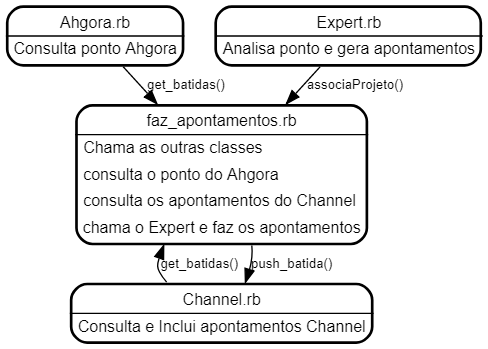

# ahgora_channel_integration
Integration of Ahgora and Channel systems


# 1. Objetivo:
Existe dois modos de opeção:

1. ImportaCSV: Lê um arquivo .csv de apontamentos e preenche o Channel;
2. ImportaAhgora: Acessa as batidas de ponto do Ahgora e preenche o Channel conforme um algoritmo previamente definido.

# 2. Requisitos:

## 2.1 Windows

- Chrome browser
	- Install Chrome: https://www.google.com/chrome/
	- Install Chrome driver: https://chromedriver.chromium.org/downloads

- Ruby + Devkit
 download and install (https://github.com/oneclick/rubyinstaller2/releases/download/RubyInstaller-2.6.6-1/rubyinstaller-devkit-2.6.6-1-x64.exe)  During installation choose option [1] to MSYS

- Install the bundler package management and run it
```
gem install bundler
bundle install
```

## 2.2 Linux Ubuntu
```bash
wget https://chromedriver.storage.googleapis.com/96.0.4664.45/chromedriver_linux64.zip
unzip chromedriver_linux64.zip

# Install Ruby
apt-get install ruby-full
config set --local path 'vendor/bundle'
# Install the bundler package management and run it
bundle install

sudo gem install tty-prompt
sudo gem install selenium-webdriver
```


# 3. Modo Importa CSV

Crie um arquivo `apontamentos.csv` conforme o exemplo abaixo:

```csv

Tipo,Projeto,Tipo de Atividade,Associar Atividade,Associar tarefa,Data,Duração,Comentarios
PROJETOS,T15C0131.0,Nenhum,2.1.5.5,Nenhum,01/12/2021,08:00,
PROJETOS,T15C0131.0,Nenhum,2.1.5.5,Nenhum,02/12/2021,08:00,
PROJETOS,T15C0131.0,Nenhum,2.1.5.5,Nenhum,03/12/2021,07:15,
PROJETOS,F01C0078.0,Nenhum,1.5,Nenhum,03/12/2021,00:45,CERTI REFLETE
PROJETOS,T15C0131.0,Nenhum,2.1.5.5,Nenhum,06/12/2021,08:00,
PROJETOS,T15C0131.0,Nenhum,2.1.5.5,Nenhum,07/12/2021,08:00,
PROJETOS,T15C0131.0,Nenhum,2.1.5.5,Nenhum,08/12/2021,08:00,
PROJETOS,T15C0131.0,Nenhum,2.1.5.5,Nenhum,09/12/2021,08:00,
PROJETOS,T15C0131.0,Nenhum,2.1.5.5,Nenhum,10/12/2021,07:15,
PROJETOS,F01C0078.0,Nenhum,1.2,Nenhum,10/12/2021,00:45,CERTI Informa
PROJETOS,T15C0131.0,Nenhum,2.1.5.5,Nenhum,13/12/2021,08:00,
PROJETOS,T15C0131.0,Nenhum,2.1.5.5,Nenhum,14/12/2021,08:00,
PROJETOS,T15C0131.0,Nenhum,2.1.5.5,Nenhum,15/12/2021,08:00,
PROJETOS,T15C0131.0,Nenhum,2.1.5.5,Nenhum,16/12/2021,08:00,
```

Observe que:
- Cada linha é uma entrada no Channel
- Nos campos de seleção (`Projeto`, `Tipo de Atividade`, `Associar Atividade`,`Associar tarefa`) apenas o começo do texto que aparece no Channel é suficiente para selecionar.
- Por enquanto o campo de comentario não está sendo inserido.

Para executar a importação execute:

```bash
export PATH=${PATH}:.
ruby source/faz_apontamentos.rb -i apontamentos.csv
```


# 4. Modo Importa Ahgora
## 4.1 Example of associaProjeto in Expert.rb:

~~~~
	# Metodo real usado - faca como o associaProjeto_exemplo e use a sua criatividade!
	def associaProjeto( _str_dia, _str_horas_trabalhadas)

		# # Edite o teu metodo aqui
		# puts "=================================================="
		# puts "Edite o arquivo Expert.rb no metodo associaProjeto"
		# puts "use o associaProjeto_exemplo como exemplo"
		# puts "crie a suas regras de associação de atividade!"
		# exit(-1)

		# daqui pra baixo segue o meu de exemplo

		result = []
		dia = valid_date( _str_dia )
		horas_saldo = parseTime(_str_horas_trabalhadas)
		prompt = TTY::Prompt.new

		@log.info "- Expert - dia: #{_str_dia} #{_str_horas_trabalhadas}"

		# ----------------------------------------
		# dependendo do dia quebra a Atividade
		# ----------------------------------------
		# Se for quarta-feira pergunta e associa o Lightning Talk de 15 minutos
		if horas_saldo > 5 and dia.wednesday? and prompt.yes?('Expert: Vc quer incluir o Lightning Talk de 15 minutos?') then
			opts = {}
			opts[:"Tipo"] = "AVULSO"
			opts[:"Cliente"] = "CERTI"
			opts[:"Natureza da operação"] = "13. Formação" # 13. Formação/Capacitação
			opts[:"Tipo de Atividade"] = "99601 " # 99601 – Lightning Talk
			opts[:"Data"] = _str_dia
			duracao = 0.25  # 15 minutos => 15/60=0.25
			opts[:"Duração"] = formatTime( duracao )
			opts[:"Comentarios"] = ""
			horas_saldo = horas_saldo - duracao
			result.push( opts )
		end

		# considera apenas os ultimos 15 dias e se o dia tem mais do que 5 horas
		if dia > ( Date.today - 15) and horas_saldo > 5 then
			# atribui o resto das horas para o projeto Y
			opts = {}
			opts[:"Tipo"] = "PROJETOS"
			opts[:"Projeto"] = "D15C0171.0"
			opts[:"Tipo de Atividade"] = "Nenhum"
			opts[:"Associar Atividade"] = "1.4.3.5.3"
			opts[:"Associar tarefa"] = "Nenhum"
			opts[:"Data"] = _str_dia
			duracao = horas_saldo
			opts[:"Duração"] = formatTime( duracao )
			opts[:"Comentarios"] = ""
			horas_saldo = horas_saldo - duracao
			result.push( opts )
		else
			@log.info "Expert: ignorou o dia: #{_str_dia} #{_str_horas_trabalhadas}"
		end
		if result.size > 0 then
			@log.info "Expert: atribuiu as seguintes atividades para o dia: #{_str_dia} #{_str_horas_trabalhadas}"
			result.each { |o| @log.info "\t\t" + o.inspect }
			@log.info "-------------------------------------------------------------------------------------------------"
		end
		return result
	end

~~~~

## 4.2 Example:


## 4.3 setup
- Edit the file `vars.rb` and put your IDs
	- put your Ahgora matricula here:
	`AHGORA_MATRICULA='12345'`
	- put your Username id here:
	`CHANNEL_USERNAME='sua_sigla'`

- Edit `faz_apontamentos.rb` and select your project details, like:
```
opts = {}
opts[:"Projeto"] = "D15C0171.0"
opts[:"Tipo de Atividade"] = "Nenhum"
opts[:"Associar Atividade"] = "1.4.3.5.3"
opts[:"Associar tarefa"] = "Nenhum"
```
dica: escolha o começo do texto das opções assim o script não para de funcionar se alguem mudar a descrição do projeto / atividade / tarefa.

## 4.4 execution
`ruby .\faz_apontamentos.rb -c SENHA_CHANNEL -a SENHA_AHGORA`


## 4.5 expected resuls

```
|2019-08-19 16:19:33|INFO:  # -------------------------------------------
|2019-08-19 16:19:33|INFO:  # Obtem batidas do Ahgora (PONTO ELETRONICO)
|2019-08-19 16:19:33|INFO:  # -------------------------------------------
|2019-08-19 16:19:50|INFO:  # ERROR: unexpected value of row2 in: ["Existem batidas �mpares"]
|2019-08-19 16:20:02|INFO:  2019-07-26, 07:50
|2019-08-19 16:20:02|INFO:  2019-07-29, 08:04
|2019-08-19 16:20:02|INFO:  2019-07-30, 08:23
|2019-08-19 16:20:02|INFO:  2019-07-31, 08:38
|2019-08-19 16:20:02|INFO:  2019-08-01, 07:17
|2019-08-19 16:20:02|INFO:  2019-08-02, 07:19
|2019-08-19 16:20:02|INFO:  2019-08-05, 07:27
|2019-08-19 16:20:02|INFO:  2019-08-06, 09:39
|2019-08-19 16:20:02|INFO:  2019-08-07, 08:13
|2019-08-19 16:20:02|INFO:  2019-08-08, 08:08
|2019-08-19 16:20:02|INFO:  2019-08-09, 07:31
|2019-08-19 16:20:02|INFO:  2019-08-12, 08:39
|2019-08-19 16:20:02|INFO:  2019-08-13, 11:20
|2019-08-19 16:20:02|INFO:  2019-08-14, 03:32
|2019-08-19 16:20:02|INFO:  2019-08-15, 10:21
|2019-08-19 16:20:02|INFO:  2019-08-16, 09:15
|2019-08-19 16:20:02|INFO:  2019-08-19, 02:12
|2019-08-19 16:20:02|INFO:  # -------------------------------------------
|2019-08-19 16:20:02|INFO:  # Obtem apontamentos atuais do Channel
|2019-08-19 16:20:02|INFO:  # -------------------------------------------

|2019-08-19 16:20:19|INFO:  2019-05-15, 09:14
|2019-08-19 16:20:19|INFO:  2019-05-16, 09:25
|2019-08-19 16:20:19|INFO:  2019-05-17, 06:49
|2019-08-19 16:20:19|INFO:  2019-05-20, 07:40
|2019-08-19 16:20:19|INFO:  2019-05-21, 07:30
|2019-08-19 16:20:19|INFO:  2019-05-22, 08:09
|2019-08-19 16:20:19|INFO:  2019-05-23, 07:36
|2019-08-19 16:20:19|INFO:  2019-05-24, 08:46
|2019-08-19 16:20:19|INFO:  2019-05-27, 06:52
|2019-08-19 16:20:19|INFO:  2019-05-28, 08:04
|2019-08-19 16:20:19|INFO:  2019-05-29, 06:52
|2019-08-19 16:20:19|INFO:  2019-05-30, 07:43
|2019-08-19 16:20:19|INFO:  2019-05-31, 07:20
|2019-08-19 16:20:19|INFO:  2019-06-03, 08:18
|2019-08-19 16:20:19|INFO:  2019-06-04, 08:18
|2019-08-19 16:20:19|INFO:  2019-06-05, 07:00
|2019-08-19 16:20:19|INFO:  2019-06-06, 07:18
|2019-08-19 16:20:19|INFO:  2019-06-07, 06:46
|2019-08-19 16:20:19|INFO:  2019-06-10, 06:30
|2019-08-19 16:20:19|INFO:  2019-06-11, 08:22
|2019-08-19 16:20:19|INFO:  2019-06-12, 06:59
|2019-08-19 16:20:19|INFO:  2019-06-13, 10:07
|2019-08-19 16:20:19|INFO:  2019-06-14, 08:16
|2019-08-19 16:20:19|INFO:  2019-06-17, 08:11
|2019-08-19 16:20:19|INFO:  2019-06-18, 07:21
|2019-08-19 16:20:19|INFO:  2019-06-19, 07:04
|2019-08-19 16:20:19|INFO:  2019-06-24, 08:58
|2019-08-19 16:20:19|INFO:  2019-06-25, 07:32
|2019-08-19 16:20:19|INFO:  2019-06-26, 08:37
|2019-08-19 16:20:19|INFO:  2019-06-27, 07:58
|2019-08-19 16:20:19|INFO:  2019-06-28, 07:52
|2019-08-19 16:20:19|INFO:  2019-07-01, 08:46
|2019-08-19 16:20:19|INFO:  2019-07-02, 07:48
|2019-08-19 16:20:19|INFO:  2019-07-03, 07:51
|2019-08-19 16:20:19|INFO:  2019-07-04, 07:26
|2019-08-19 16:20:19|INFO:  2019-07-05, 07:34
|2019-08-19 16:20:19|INFO:  2019-07-08, 08:23
|2019-08-19 16:20:19|INFO:  2019-07-09, 09:07
|2019-08-19 16:20:19|INFO:  2019-07-10, 08:34
|2019-08-19 16:20:19|INFO:  2019-07-11, 07:30
|2019-08-19 16:20:19|INFO:  2019-07-12, 07:58
|2019-08-19 16:20:19|INFO:  2019-07-15, 08:20
|2019-08-19 16:20:19|INFO:  2019-07-16, 08:26
|2019-08-19 16:20:19|INFO:  2019-07-17, 07:51
|2019-08-19 16:20:19|INFO:  2019-07-18, 07:49
|2019-08-19 16:20:19|INFO:  2019-07-22, 07:12
|2019-08-19 16:20:19|INFO:  2019-07-23, 07:34
|2019-08-19 16:20:19|INFO:  2019-07-24, 07:48
|2019-08-19 16:20:19|INFO:  2019-07-25, 07:51
|2019-08-19 16:20:19|INFO:  2019-07-26, 07:50
|2019-08-19 16:20:19|INFO:  2019-07-29, 08:04
|2019-08-19 16:20:19|INFO:  2019-07-30, 08:23
|2019-08-19 16:20:19|INFO:  2019-07-31, 08:38
|2019-08-19 16:20:19|INFO:  2019-08-01, 07:17
|2019-08-19 16:20:19|INFO:  2019-08-02, 07:19
|2019-08-19 16:20:19|INFO:  2019-08-05, 07:27
|2019-08-19 16:20:19|INFO:  2019-08-06, 09:39
|2019-08-19 16:20:19|INFO:  2019-08-07, 08:13
|2019-08-19 16:20:19|INFO:  2019-08-08, 08:08
|2019-08-19 16:20:19|INFO:  2019-08-09, 07:31
|2019-08-19 16:20:19|INFO:  2019-08-12, 08:39
|2019-08-19 16:20:19|INFO:  2019-08-13, 11:20
|2019-08-19 16:20:19|INFO:  2019-08-14, 07:02
|2019-08-19 16:20:19|INFO:  2019-08-15, 10:21
|2019-08-19 16:20:19|INFO:  2019-08-16, 09:15
|2019-08-19 16:20:19|INFO:  # -------------------------------------------
|2019-08-19 16:20:19|INFO:  # Ahgora x Channel - Analise
|2019-08-19 16:20:19|INFO:  # -------------------------------------------
|2019-08-19 16:20:19|INFO:  26/07/2019: 07:50 ok
|2019-08-19 16:20:19|INFO:  29/07/2019: 08:04 ok
|2019-08-19 16:20:19|INFO:  30/07/2019: 08:23 ok
|2019-08-19 16:20:19|INFO:  31/07/2019: 08:38 ok
|2019-08-19 16:20:19|INFO:  01/08/2019: 07:17 ok
|2019-08-19 16:20:19|INFO:  02/08/2019: 07:19 ok
|2019-08-19 16:20:19|INFO:  05/08/2019: 07:27 ok
|2019-08-19 16:20:19|INFO:  06/08/2019: 09:39 ok
|2019-08-19 16:20:19|INFO:  07/08/2019: 08:13 ok
|2019-08-19 16:20:19|INFO:  08/08/2019: 08:08 ok
|2019-08-19 16:20:19|INFO:  09/08/2019: 07:31 ok
|2019-08-19 16:20:19|INFO:  12/08/2019: 08:39 ok
|2019-08-19 16:20:19|INFO:  13/08/2019: 11:20 ok
|2019-08-19 16:20:19|INFO:  14/08/2019: 03:32 (ahgora) != 07:02 (channel)
|2019-08-19 16:20:19|INFO:  15/08/2019: 10:21 ok
|2019-08-19 16:20:19|INFO:  16/08/2019: 09:15 ok
|2019-08-19 16:20:19|INFO:  19/08/2019 02:12 (ahgora): channel novo apontamento!
|2019-08-19 16:20:19|INFO:  # -------------------------------------------
|2019-08-19 16:20:19|INFO:  # Insere novos apontamentos
|2019-08-19 16:20:19|INFO:  # -------------------------------------------
|2019-08-19 15:22:11|INFO:  push_batida: {:Projeto=>"D15C0171.0", :"Tipo de Atividade"=>"Nenhum", :"Associar Atividade"=>"1.4.3.5.3", :"Associar tarefa"=>"Nenhum", :Data=>"15/08/2019", :Dura��o=>"10:21"}
|2019-08-19 15:22:14|INFO:  REGISTRO INSERIDO COM SUCESSO!
```

Enjoy!

# 5. Architecture:



## 5.1 Como funciona:
O script em Ruby controla uma instancia do browser e abre o Ahgora e o Channel. O script então navega pelas paginas da mesma forma que o usuário normal e obtem um relatório do ultimo mês do Ahgora e do Channel. Ele então faz a comparação entre o ponto eletronico e os apontamentos de projetos. A seguir ele mostra os novos apontamentos e pede a confirmação para inseri-los no Channel.

O projeto, tarefa, etc é atribuido pelo Script de forma automática. Quem for usá-lo deve portanto modificar o script para o seu projeto default ou estabelecer regras ou divisões para quebrar as batidas do ponto em quantos apontamentos forem necessários.


# 6. Todo/Bugs/Sugestões:
- Consultar https://github.com/lucribas/ahgora_channel_integration

